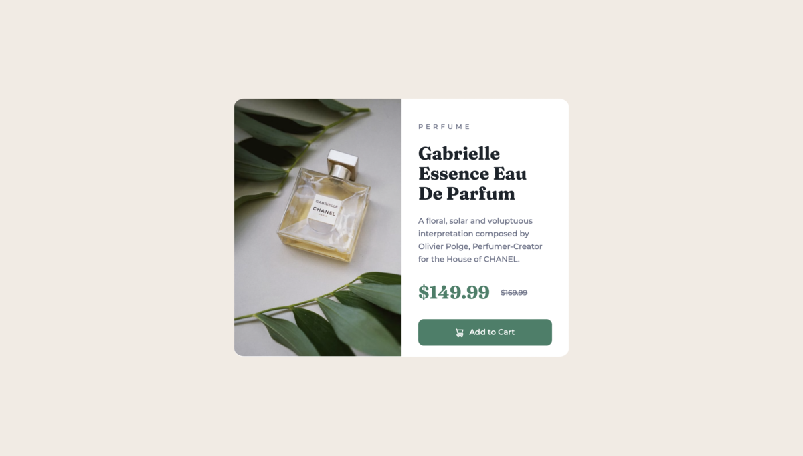
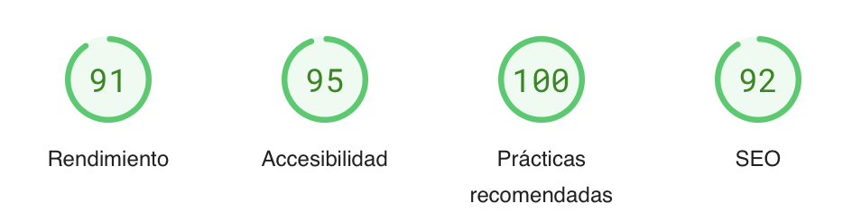
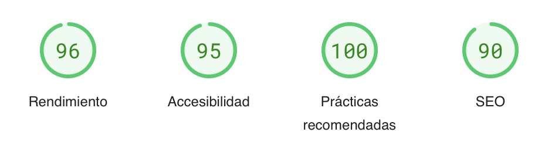

<!-- Proyect -->

  

  <h1 align="center">Product preview card component</h1>
  

    <a href="https://www.frontendmentor.io/challenges/product-preview-card-component-GO7UmttRfa" target="_blank"><strong>Frontend Mentor Challenge</strong></a>
     
     
    <a href="https://magnificent-croquembouche-079066.netlify.app" target="_blank">View Demo</a>
    &nbsp;·&nbsp;
    <a href="https://github.com/MonicaSasGue/Product-preview-card-component.git" target="_blank">Report Feedback</a>
  

  <!-- Profile -->
   &nbsp;&nbsp;&nbsp;

  <!-- Status -->
   &nbsp;&nbsp;&nbsp;

  <!-- Difficulty -->
  

 
 

<!-- preview -->

  <h2>Preview</h2>
  

 
  

<!-- The Challenge -->

  <h2>The Challenge</h2>
  
An HTML and CSS challenge with responsive design.

  
The users should be able to:
     
    - View the optimal layout depending on their device's screen size
     
    - See hover and focus states for interactive elements

  </ br>
  
End date: May 2023

 
  

<!-- Built With -->

  <h2>Built With</h2>
  
  &nbsp;
  

 
  

<!-- PageSpeed -->

  <h2>PageSpeed - Movil</h2>
  

  <h2>PageSpeed - Desktop</h2>
  
  

     
    <a href="https://pagespeed.web.dev/analysis/https-magnificent-croquembouche-079066-netlify-app/epm4wqj49x?form_factor=mobile">Check out Pagespeed Insights to get live score</a>
  

 
  
 
 

<!-- Acknowledgment -->

  <h2>Acknowledgment</h2>
  
Challenge was provided by <a href="https://www.frontendmentor.io">Frontend Mentor</a>

 
 

<!-- profiles -->

  &nbsp;&nbsp;&nbsp;

   &nbsp;&nbsp;&nbsp;

  

 
 
